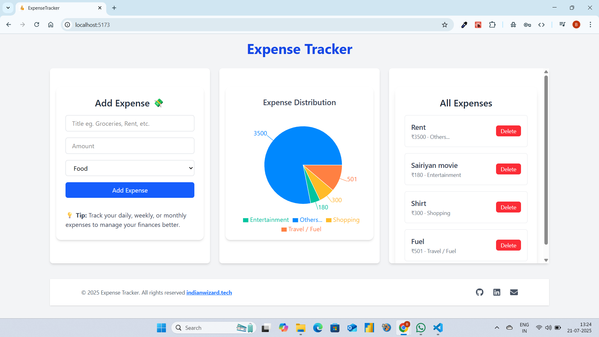

# 💰 Real-Time Expense Tracker

A full-stack MERN (MongoDB, Express, React, Node.js) application to track your expenses with real-time charts and a sleek user interface.

---

## 🚀 Features

- 📝 Add expenses with title, price, and category
- 📋 View expenses in a detailed list
- 📊 Visualize data with interactive charts using Recharts
- ⚡ Real-time updates with a responsive frontend
- ☁️ Store data securely using MongoDB Atlas

---

## 🧰 Tech Stack

| Frontend                              | Backend            | Database      |
|---------------------------------------|---------------------|---------------|
| React, Vite, Tailwind CSS, Recharts  | Node.js, Express.js | MongoDB Atlas |

---

## 🛠️ Installation & Setup Guide

### 📥 1. Clone the Repository

git clone https://github.com/Baiju2005/expense-tracker-mern.git  
cd expense-tracker-mern

---

### 🔌 2. Setup the Backend

cd server  
npm install

Create a `.env` file inside the `server/` folder and add the following:

MONGO_URL=your_mongodb_connection_string  
PORT=5000

To start the backend server:

npm start

---

### 🌐 3. Setup the Frontend

cd ../client  
npm install  
npm run dev

Your frontend will run at: http://localhost:5173

---

## 📸 Screenshots

### 💻 Dashboard View

---

## 🙋‍♂️ Author

**Name**: Baiju Kumar Yadav  
**GitHub**: https://github.com/Baiju2005

---

## 📄 License

This project is open-source and available under the MIT License.

---

## 🌟 Support

If you like this project, don’t forget to ⭐ the repo and share it!
